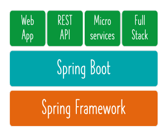

# Spring Framework Notes

Go to [start.spring.io](http://start.spring.io) and download your spring boilerplate application.

We are going to design game runner app that runs 3 games (classes)

1. SuperContra
2. MarioGame
3. PacmanGame

Before using spring framework lets make use of Java to build and run these classes

Add the  AppGamingBasicJava which will run the game classes

.png)

Add the GameRunner Class in game package

.png)

Add the game classes in the game package

eg MarioGame

.png)

Now you can see the game classes are tightly coupled if want to run another game 

We will have to make changes to the GameRunner Class and add another constructor to it

Coupling is important in Software Development

We can make this tight couple behavior to loosely coupled by adding an interface for the three game classes

These classes will implement this interface and we will use this interface in the GameRunner class

To avoid code changes when we wanna run a different game class

Let’s call this interface GamingConsole

[https://www.notion.so](https://www.notion.so)

Also, add it to the GameRunner class

.png)

So this is how we would build an App in Java. 

Here you can see we ourselves did the Coding, Wiring and you can say even configuration.

The number of lines of code and time taken is higher. How can we reduce this?

## Spring Framework

Let’s see how spring framework can help us in doing this faster…

 Add another class in main package HelloWorldSpring.java

.png)

We Need to build another class called HelloWorldConfiguration which will have the Spring annotatoin @Configuration

.png)

Every Configuration class in Spring has Bean Methods

@Configuration just indicates that the class has bean methods. So Spring container can process the class and generate Spring Beans to be used in the application.

@Bean annotation indicates that a method produces a bean to be managed by the Spring container. Bean is object that is managed by Spring. 

Application Context is used to load Bean definitions 

Eg. **var context = new AnnotationConfigApplicationContext(HelloWorldConfiguration.class);**

We can makek use of this object to load beans: 

**context.getBean("address2")** // we pass the bean method name

## Applying Spring Concepts to Build GameRunner app

Add the application context class which will get the beans

[App03AppGamingSpringBeans.java](http://App03AppGamingSpringBeans.java) 

.png)

GamingConfiguration is the config file for our app which will contain the Spring beans

.png)

Context is in try-with block so that java will close the context for us. This will avoid any leaks.

Our Spring App is ready. Now Spring is managing the Data for us and autowiring it. 🙂